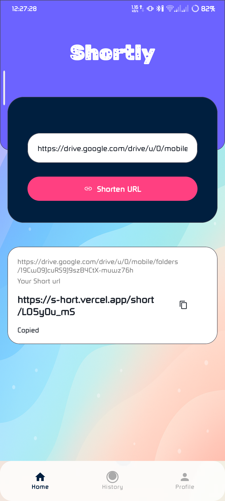
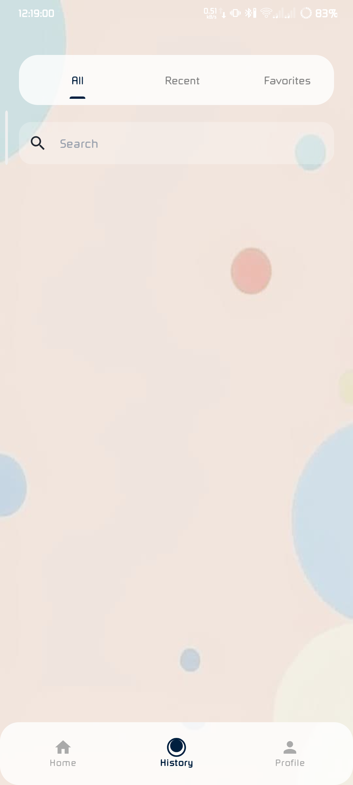
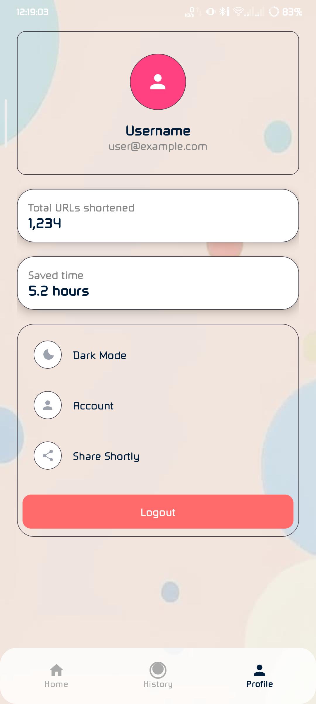

# Shortly - Android URL Shortener App
<!-- ALL-CONTRIBUTORS-BADGE:START - Do not remove or modify this section -->
[](#contributors-)
<!-- ALL-CONTRIBUTORS-BADGE:END -->

Shortly is a modern, visually appealing Android app that allows users to quickly shorten URLs using a remote API. The app features a beautiful Material3-based UI, smooth navigation, and a simple user experience.

## Features

- **Modern Material3 UI**: Vibrant colors, gradients, and card-based layouts for a unique look.
- **URL Shortening**: Paste any URL and get a shortened version instantly.
- **Copy to Clipboard**: Easily copy the shortened URL with a single tap.
- **Loading Indicator**: Shows a loading spinner while the URL is being shortened.
- **History Screen**: Placeholder for viewing your previously shortened URLs (ready for future expansion).
- **Profile Screen**: Placeholder for user profile info (ready for future expansion).
- **Bottom Navigation**: Quickly switch between Home, History, and Profile screens.
- **Responsive Design**: Looks great on phones and tablets.

## Screenshots

| Home Screen | History Screen | Profile Screen |
|:-----------:|:-------------:|:--------------:|
|  |  |  |

## Getting Started

### Prerequisites
- Android Studio (latest recommended)
- Android SDK 27+

### Build & Run
1. Clone this repository:
   ```bash
   git clone https://github.com/mojahid2021/url_shortener.git
   ```
2. Open in Android Studio.
3. Build and run on an emulator or device.

### API
- The app uses a remote API at `https://s-hort.vercel.app/api/shorten` for URL shortening.
- For development, SSL certificate validation is disabled (see `ApiClient.java`).

## Contributors

<!-- readme: contributors -start -->
<!-- ALL-CONTRIBUTORS-LIST:START - Do not remove or modify this section -->
<!-- prettier-ignore-start -->
<!-- markdownlint-disable -->
<table>
  <tbody>
    <tr> 
       <td align="center" valign="top" width="14.28%"><a href="https://mojahid-dev.vercel.app/"><br /><sub><b>Md Mojahid</b></sub></a><br /><a    href="https://github.com/mojahid2021/Shortly-apk/commits?author=mojahid2021" title="Code">💻</a></td>
    </tr>
      <td align="center" valign="top" width="14.28%"><a href="https://github.com/khaliduzzamantanoy"><br /><sub><b>MD. KHALIDUZZAMAN TANOY</b></sub></a><br /><a href="https://github.com/mojahid2021/Shortly-apk/commits?author=khaliduzzamantanoy" title="Code">💻</a></td>
  </tbody>
</table>

<!-- markdownlint-restore -->
<!-- prettier-ignore-end -->

<!-- ALL-CONTRIBUTORS-LIST:END -->
<!-- readme: contributors -end -->


## License

This project is licensed under the MIT License. See the [LICENSE](LICENSE) file for details.

---

**Made with ❤️ using Material3 and Retrofit.**
